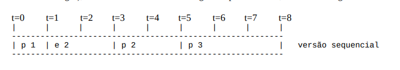
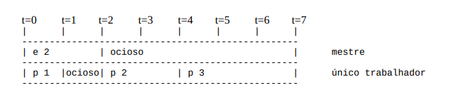
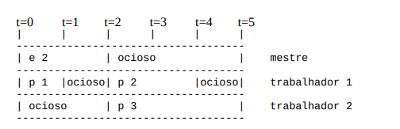

# Programando em Paralelo: Pthreads

**Introdução**

O objetivo principal desta atividade é ganhar experiência com paralelismo multicore usando a
biblioteca POSIX Pthreads padrão, incluindo exposição a conceitos de multithreading, como
mutexes e condições. O objetivo secundário é ganhar experiência na implementação de um modelo
de fila de tarefas mestre/trabalhador de computação paralela.

**Descrição**

O programa lê uma lista de "tarefas" de um arquivo. Cada tarefa consiste em um código de
caractere que indica uma ação e um número. O código do caractere pode ser um "p" (para
"processar") ou "e" (para "esperar"). O arquivo de entrada simula várias cargas de trabalho entrando
em um sistema de multiprocessamento. Em um sistema real, as ações "p" (as tarefas) provavelmente
seriam chamadas para rotinas computacionais. Para nossos propósitos, "processar" uma tarefa com
número n significa apenas esperar n segundos usando a função sleep e então atualizar algumas
variáveis agregadas globais (soma, contagem ímpar, mínimo e máximo). A ação "e" fornece uma
maneira de simular uma pausa nas tarefas de entrada.

Por exemplo, o script a seguir simula uma tarefa inicial de um segundo entrando no sistema,
seguida por um atraso de dois segundos. Após o atraso, uma tarefa de dois segundos entra no
sistema seguida por uma tarefa de três segundos.

```
p 1
e 2
p 2
p 3
```

Usando um sistema de processamento puramente serial (conforme implementado em sum.c contido
no Buraco Negro), o cenário acima levará oito segundos para terminar, conforme a seguir.



A saída final deve corresponder ao seguinte (soma, # ímpar, mínimo, máximo):

`6 2 1 3`

Neste projeto, você vai estender este programa para aproveitar as vantagens de uma CPU multicore
usando um modelo de fila de tarefas. Nesse modelo, o programa principal gera um número definido
de threads de trabalho. Você deve ler o número de threads da linha de comando como um novo
segundo parâmetro. O programa principal e os threads de trabalho se comunicam usando uma fila
de tarefas para controlar as tarefas que ainda precisam ser processadas.

Observe que se permitíssemos que a primeira tarefa fosse processada durante a espera, poderíamos
reduzir o tempo em um único segundo:



Isso pode ser obtido dividindo o trabalho de processamento real em um thread de trabalho que pode
funcionar paralelamente ao thread mestre original. Isso permite que o thread mestre se concentre em
receber trabalhos, enquanto o thread de trabalho se concentra em fazer o trabalho real. No cenário
acima, a primeira tarefa chega em t = 0, enquanto as duas segundas tarefas chegam
simultaneamente em t = 2.

Como nossas tarefas são independentes, a situação pode ser melhorada ainda mais com a adição de
mais threads de trabalho, supondo que tenhamos núcleos de CPU físicos suficientes para tirar
proveito deles. No exemplo acima, as duas últimas tarefas podem ser executadas simultaneamente
para economizar dois segundos adicionais:



Seu programa deve funcionar da seguinte maneira. No início da execução, o thread mestre gera um
número definido de threads de trabalho (fornecido por um parâmetro de linha de comando). Os
threads de trabalho estão inativos no início. Uma vez que os trabalhadores tenham sido totalmente
inicializados, o mestre então começa a lidar com as tarefas do arquivo de entrada adicionando-os a
uma fila de tarefas, ativando um thread de trabalho ocioso (se houver) para cada tarefa. Quando um
thread é ativado, eles começam a puxar tarefas da fila e processá-las. Se a fila ficar sem tarefas, o
trabalhador deve bloquear novamente até ser acordado pelo mestre. Se o mestre encontrar um
comando "e" (esperar), ele aguardará o número determinado de segundos antes de continuar no
arquivo de entrada. Depois que todas as tarefas foram adicionadas à fila, o mestre espera que a fila
se esgote, ativando os threads inativos conforme necessário para ajudar. Quando a fila está vazia, o
mestre espera que os trabalhadores não ociosos terminem e, em seguida, define um sinalizador
global para indicar que todo o programa foi concluído, reativando todos os threads de trabalho para
que possam ser encerrados. O mestre então limpa tudo e sai.

Para implementar o sistema acima, você deve usar threads de Pthread, mutexes e condições
conforme abordado na aula. Seu programa deve considerar o número de threads de trabalho como
um segundo parâmetro de linha de comando; o desempenho em cargas de trabalho paralelizáveis
deve ser escalonado linearmente com o número de threads. Você deve usar pelo menos um mutex
(embora provavelmente precise de mais de um) e pelo menos uma condição. Você também deve
manter uma estrutura de dados da fila de tarefas explícita.

**Você NÃO PODE usar semáforos para esta tarefa.** Embora possa haver uma solução para esse
problema usando semáforos, um dos principais objetivos deste projeto é ganhar experiência com
mutexes e condições.

**Submissão**

Você deve copiar sum.c em um novo arquivo chamado par_sum.c e modificá-lo para implementar o
sistema mestre/trabalhador descrito acima. Seu programa modificado deve aceitar DOIS parâmetros
de linha de comando em vez de um: 1) o nome do arquivo de entrada e 2) o número de threads de
trabalho. Seu programa deve ser compilado em sistemas Linux compatíveis com POSIX usando o
seguinte Makefile:

```
default: sum par_sum

sum: sum.c
gcc -g -O2 --std=c99 -Wall -o sum sum.c

par_sum: par_sum.c
gcc -g -O2 --std=c99 -Wall -o par_sum par_sum.c -lpthread

clean:
rm -f sum par_sum
```

Você deve submeter um pacote zip contendo: (1) makefile, (2) par_sum.c, (3) fontes do relatório em
latex e (4) pdf do relatório.
